# Introduction
Le point de départ de ce projet a été pensé pour les rendez-vous médicaux. Nous avons formulé l'hypothèse que les annulations de rendez-vous de dernière minute entrainent une perte financière importante avec une surcharge administrative. Nous avons élargi le public cible pour y mettre tout les métiers basés sur des rendez-vous avec des clients. Par exemple: médecin, coiffeur, garagiste, professeur privé, etc. Le projet consistait alors à faire de la replanification automatique de rendez-vous.  
Après plusieurs analyses d'entretiens qui seront détaillées à la section [analyse entretiens](#analyse-entretiens), nous avons décidé de mieux spécifier le public cible: **les formateurs indépendants**. Ils sont ceux qui ont la plus grosse perte (temps et argent) lié aux annulations de rendez-vous.  
Notre problématique est donc: **Comment des entreprises de formation indépendantes peuvent gérer leurs annulations de rendez-vous pour limiter la perte financière et diminuer la charge administrative.**  
Notre public cible est aussi déterminé par sa gestion des rendez-vous artisanal. Souvent, par what's app ou similaire.  
Notre solution consiste donc à déployer pour chaque client une nouvelle gestion de rendez-vous basé sur l'ancienne avec une meilleure vision d'ensemble qui sera amené par un dashboard. Accompagné de possibles automatisations, dont le rappel automatique qui, statistiquement, réduit énormément le risque d'oubli d'un rendez-vous.

# Equipe
Notre équipe est consitué de 2 programmeurs:  
- Sebastian Diaz : rôles clés: Gestion d'entretien, programmation, choix technologique
- Nicolas Bovard : rôle clés: Analyse d'entretiens, programmation, notes et rapport

# Hypothèses

## Professionel
1. Les absences représentent une perte financière significative.    
2. Les professionnels n’ont pas le temps de gérer manuellement les listes d’attente.
3. Les outils actuels sont trop complexes ou mal adaptés aux petites structures.
4. Les professionnels souhaiteraient automatiser la réattribution des créneaux.
5. Le critère d’équité dans la réattribution est important.

## Client
6. Les clients seraient intéressés par un système de notification automatique.
7. Les clients oublient leurs rendez-vous.
9. Les clients désirent réduire leur perte financière en cas d'oublie
8. Les clients accepteraient un système de priorisation (ex : premier inscrit, urgence, fidélité).
10. Les clients seraient prêts à activer une option “prévenez-moi si une place se libère”.

\hypertarget{analyse-entretiens}{}
# Analyse entretiens

Nos entretiens ont fait ressortir que le domaine médicale n'a pas vraiment besoin de problèmes avec les annulations. Ils prennent ce temps pour les urgences, et même s'il n'y en a pas, il y a toujours quelqu'un qui a besoin d'un rendez-vous. Ils arrivent à couvrir un peu près 100% des annulations en très peu de temps.

Nous avons aussi une observation sur le domaine estéthique. Nous avons des réponses de 2 stylistes ongulaire. Ce qui en ressort est qu'ils perdent un peu de temps et d'argent mais c'est tout à fait gérable. Ils arrivent souvent à retrouver quelqu'un, et il existe déjà des applications comme Salonkee pour les aider si jamais.

Nous avons analysé le domaine de la restauration. Ils ont aussi des applications qui gèrent toute la gestion de réservation, comme theFork. 

Nous avons une observation de professeur d'auto-école, nous avons donc remarqué que le domaine de la formation indépendante plus de problèmes. Etant donné qu'ils dépendent directement des clients pour être payé, ils peuvent estimer beaucoup mieux les pertes financières qui sont vraiment élevés. Ils perdent beaucoup de temps à trouver des remplacants, et c'est même plutôt rare d'en trouver. Leur système de prise de rdv utilise what's app, ce qui n'est pas toujours adapté. Cela mélange la vie pro et la vie privée. Répondre aux messages et trouver des crénaux prend du temps. Il n'existe pas de solution générale pour toute les auto école.

# Idées

1. Formation à what's app buisness, relié à un dashboard sur le web pour aider le formateur à la gestion, et trouver facilement des remplaçants (num de téléphone, adresse, nom, ...). Un scheduler fait des rappels de rdv.

2. Site web ou application directement spécialisé pour tout les professeurs d'auto-école avec :
    - Position géographique
    - Reattribution automatique de rendez-vous
    - Aide à la recherche de clients
    - Lien avec calendrier

Nous avons décidé de faire la 1ère solution avec What's app Buisness. Les raisons sont que:
- Faire une nouvelle application n'est pas utile étant donné qu'il existe déjà énormément d'applications pouvant faire la même chose. Le but est de rendre accessible notre solution, non de devoir encore apprendre à gérer une nouvelle application.
- L'automatisation et la prise en main seront plus rapide étant donné que What's app est très commun.  
- La solution peut s'étendre à tout type de formateurs indépendant et pas seulement aux professeurs d'auto-école.
# Analyse du marché
Notre projet a plusieurs concurrent. Mais la plupart sont spécialisés dans d'autres domaines:
- OneDoc: spécialisé en médecine
- SalonKee: spécialisé en ésthétique
- TheFork: spécialisé en restauration
- Sites web: Une partie du public ont des sites web personnalisés qui couvre tout ou une partie de ce qu'on propose. C'est la plus grosse concurrence de notre projet, voici les avantages de choisir Gestion TemPro:
    

# Technologies
Cette partie présente les choix technologiques retenus pour le MVP.

## Technologies implémentées dans le MVP

| Couche | Technologie | Rôle / Justification |
|---|---|---|
| Versioning | Git + GitHub | Code source, collaboration |
| Langage | TypeScript | Un seul langage front + back, typage fort |
| Frontend | Next.js | SSR pour le SEO, App Router, API routes intégrées |
| Styling | Tailwind CSS | Prototypage rapide, responsive natif |
| Backend | Next.js API Routes | Monolithique simple pour le MVP |
| ORM | Prisma | Typage fort avec TS, migrations simples |
| Base de données | PostgreSQL | Relationnel, fiable, données structurées |
| Validation | Zod | Validation des entrées côté serveur |
| Authentification | NextAuth.js | Sessions sécurisées avec credentials |
| Messaging | WhatsApp Business Cloud API (Meta) | Canal principal, bot de réservation |
| Containerisation | Docker + Docker Compose | Isolation des services, reproductible |
| CI/CD | GitHub Actions | Lint, build, tests automatisés |

## Technologies prévues ou partiellement intégrées

| Couche | Technologie | Statut |
|---|---|---|
| Paiement | Stripe | Prévu / en préparation |
| SMS backup | Twilio | Prévu |
| Calendrier | Google Calendar API | Prévu |
| Hébergement | Vercel (platform) | Cible de déploiement |
| Monitoring | Sentry | Futur |

## Justification des choix

**Pourquoi TypeScript partout ?**  
Un seul langage pour le frontend et le backend. Cela permet de travailler sur toute l'application sans changer de contexte. Le typage fort réduit les bugs et Prisma génère automatiquement les types depuis le schéma de la base de données.

**Pourquoi Next.js ?**  
Next.js combine le frontend React et le backend (API Routes) dans un seul projet. Pour un MVP, c'est idéal : pas besoin de gérer deux repos ou deux serveurs séparés. Le SSR est utile pour le référencement et pour les pages publiques.

**Pourquoi PostgreSQL ?**  
Les données sont très structurées : un professionnel a des services, des clients, des rendez-vous et des paiements. PostgreSQL gère cela nativement avec des clés étrangères, des contraintes d'intégrité et des index performants.

**Pourquoi Prisma ?**  
C'est l'ORM standard pour TypeScript et PostgreSQL. On définit le schéma dans un seul fichier, puis Prisma génère le client TypeScript et facilite les migrations. Cela simplifie l'accès à la base de données.

**Pourquoi WhatsApp Business Cloud API ?**  
C'est le cœur du produit. L'API de Meta permet d'envoyer et recevoir des messages WhatsApp via des webhooks. Le client final n'a rien à installer : le bot reçoit une demande, propose les créneaux, confirme puis envoie un rappel.

**Pourquoi Docker Compose ?**  
En développement, Docker Compose permet de lancer PostgreSQL et l'application avec une configuration reproductible. En production, cette base facilite le déploiement sur un VPS.

**Pourquoi GitHub Actions ?**  
GitHub Actions est intégré à GitHub et permet d'automatiser les vérifications du projet : lint, build et validation de la base de données de test.

## Technologies à venir

Les éléments ci-dessous ne font pas encore partie du MVP finalisé, mais ils restent cohérents avec la suite du projet :

- Stripe pour la gestion des paiements.
- Google Calendar API pour la synchronisation des rendez-vous.
- Twilio comme solution de secours par SMS.
- Sentry pour le suivi des erreurs en production.
- Vercel comme cible d'hébergement (plateforme serverless).

# Produit final
Notre produit final se concrétise à travers deux interfaces complémentaires : d'un côté, un bot conversationnel via WhatsApp pour le client final, et de l'autre, un Dashboard d'administration complet sur le web pour le professionnel. Cette approche hybride garantit zéro friction à l'usage pour le client et un contrôle total de l'activité pour le formateur.

## Architecture du système
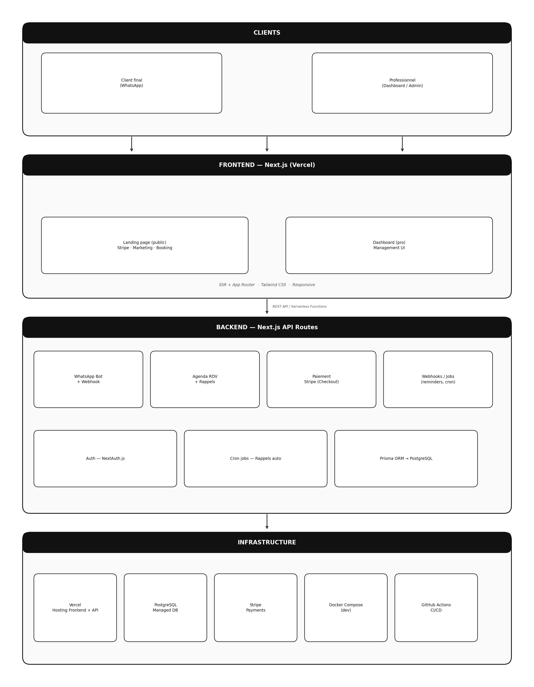{width=75%}

## Schéma de la base de données

La base de données est le cœur du système. Elle organise les professionnels, leurs services, leurs clients, les rendez-vous, les disponibilités et les messages WhatsApp.

## Vue d'ensemble des tables

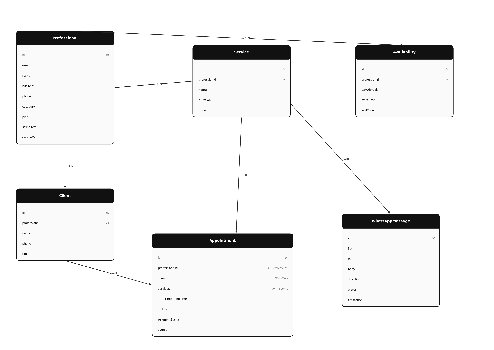{width=75%}

## CI/CD — Intégration et déploiement continu

À chaque push sur la branche principale ou à chaque pull request, GitHub Actions peut exécuter automatiquement :

1. Lint pour vérifier les conventions de code.
2. Build pour compiler l'application Next.js et générer le client Prisma.
3. Vérification de la base de données de test pour s'assurer de la cohérence du schéma.

## Expérience Client

Le client interagit exclusivement via l'application de messagerie qu'il utilise déjà au quotidien : **WhatsApp**. L'objectif est de ne lui imposer aucun téléchargement ni création de compte complexe, réduisant ainsi la barrière à l'entrée.

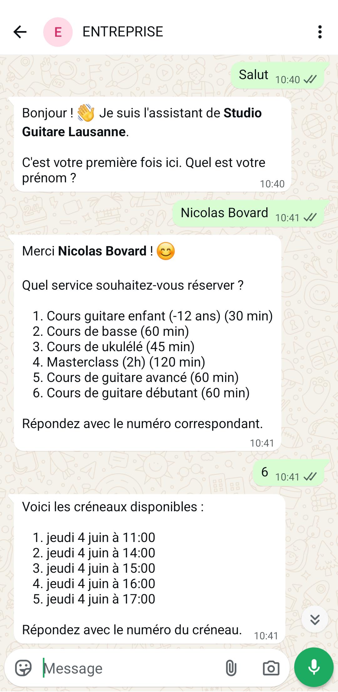{width=30% fig-align="center"}

Comme illustré ci-dessus, le bot conversationnel prend en charge l'entier du flux de réservation :
- **Identification automatique** (ou demande du prénom lors de la toute première interaction).
- **Sélection du service** souhaité depuis une liste numérotée.
- **Proposition dynamique des créneaux horaires**, basée en temps réel sur les disponibilités du calendrier du professionnel.
- **Confirmation immédiate** du rendez-vous, déclenchant automatiquement la programmation d'un **rappel** (24h à l'avance par exemple) pour diminuer le risque d'absence.

## Expérience Professionnel

Le professionnel accède à une plateforme sécurisée en ligne, le "Dashboard", pour centraliser la gestion de son entreprise et de ses prises de rendez-vous.

**1. Vue d'ensemble (Dashboard)**
Un résumé des rendez-vous à venir et des principaux indicateurs financiers ou d'activité, permettant au professionnel d'avoir une vision claire sur sa semaine dès sa connexion.

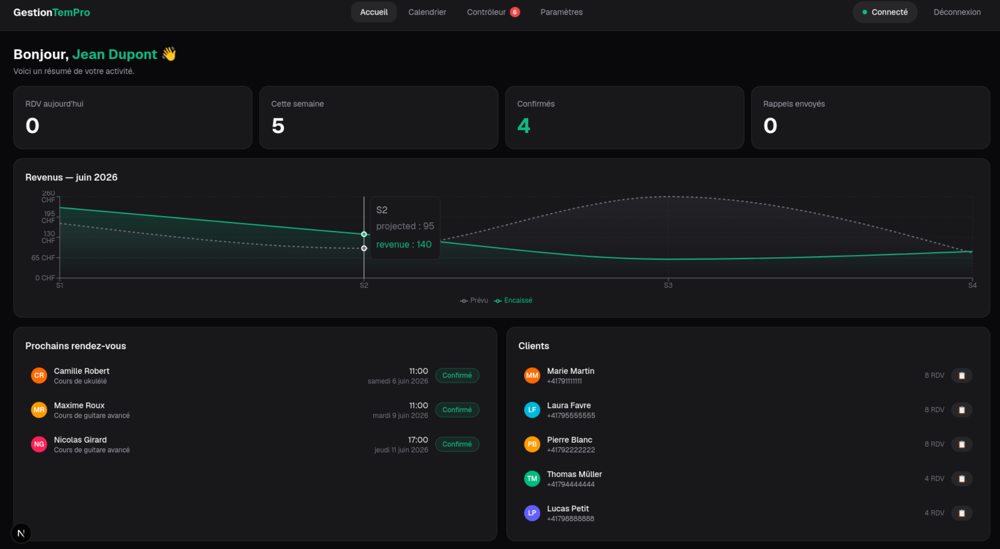{width=70%}

**2. Calendrier interactif**
Une interface visuelle classique permettant d'appréhender facilement les périodes creuses, avec la possibilité d'ajouter ou de modifier des événements manuellement.

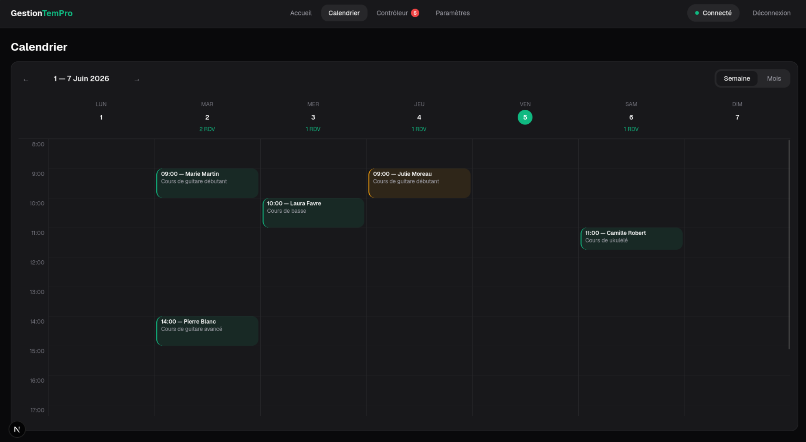{width=70%}

**3. Contrôleur (Gestion dynamique)**
Un écran pensé pour les actions rapides et journalières : liste des clients actifs, statut des rendez-vous et outils de communication (replanification, avertissement de retard).

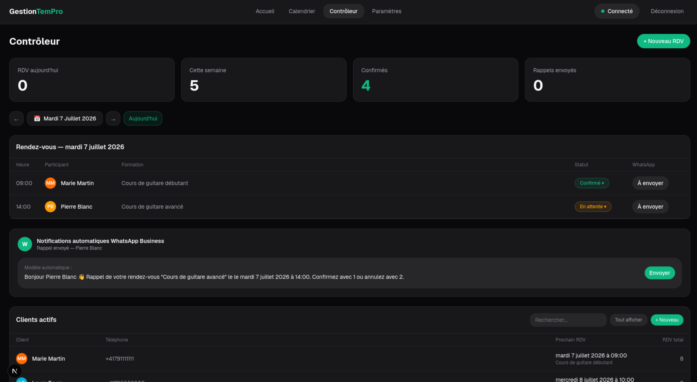{width=70%}

**4. Paramètres avancés de l'application**
Cette zone donne au professionnel une totale autonomie sur le fonctionnement méticuleux du bot et de la prise de rendez-vous. Il n'a plus besoin d'un technicien pour adapter son environnement de travail.

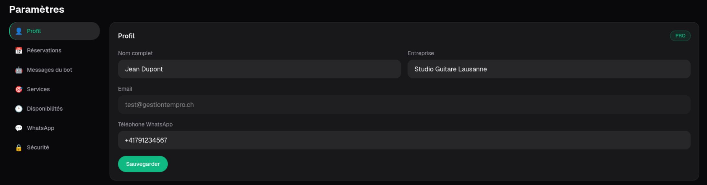{width=55% fig-pos="H"}

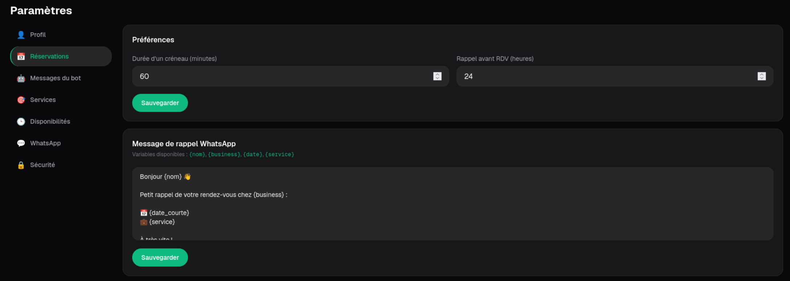{width=55% fig-pos="H"}

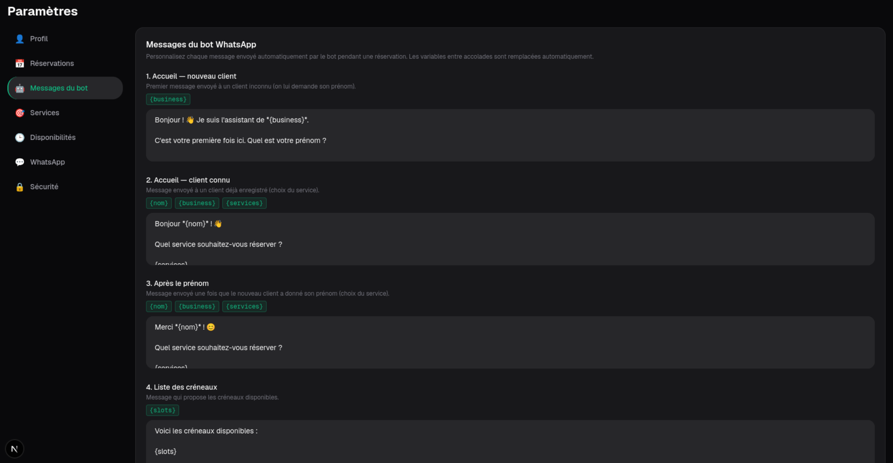{width=55% fig-pos="H"}

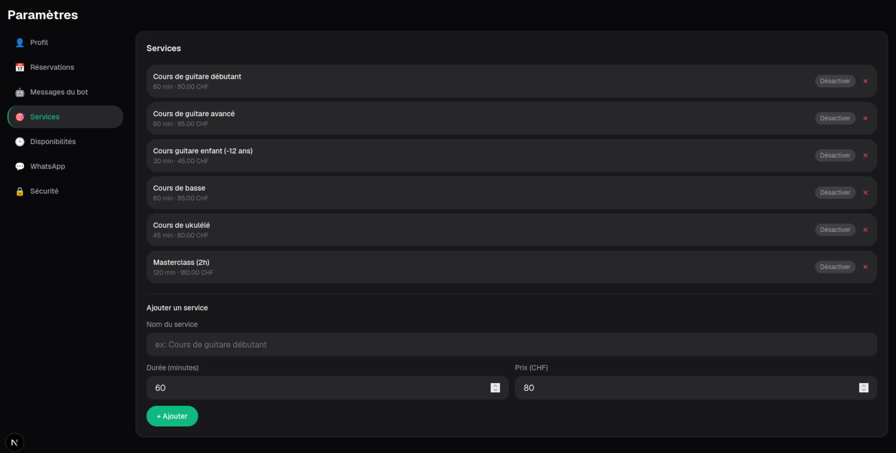{width=55% fig-pos="H"}

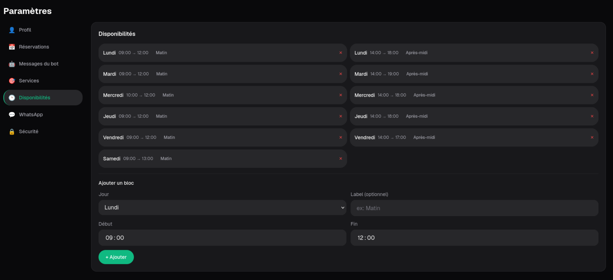{width=55% fig-pos="H"}

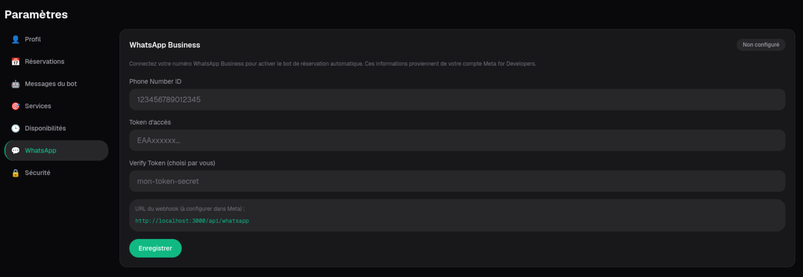{width=55% fig-pos="H"}

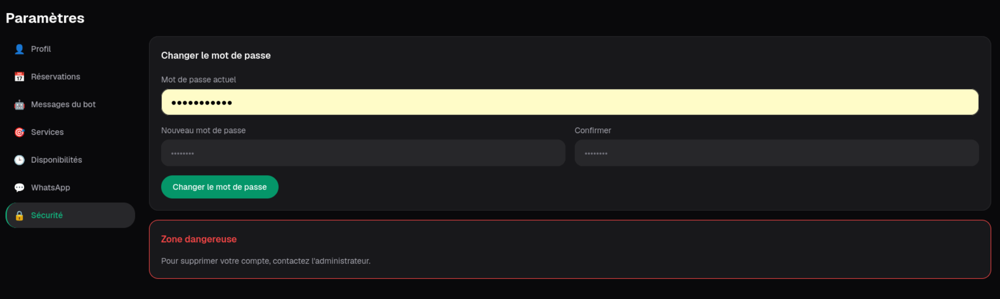{width=55% fig-pos="H"}

Ces écrans de configuration détaillés permettent de gérer de façon autonome :
- **Le profil et les disponibilités hebdomadaires** : Définition des jours de travail, de repos, et de l'image de la marque.
- **Les Services** : Ajout de nouveaux cours ou rendez-vous, avec la gestion des durées et des tarifs.
- **La personnalisation du Bot** : L'accès à la modification directe des scripts conversationnels envoyés par WhatsApp (texte d'accueil, liste des créneaux, rappel textuel personnalisé).
- **La configuration technique de l'API** : Le réglage de ses accès aux webhooks WhatsApp ou des relances automatisées.

# Modèle économique

Le modèle économique retenu est un **abonnement mensuel** pour les professionnels, avec un prix construit à partir des coûts réels (hébergement, maintenance, support, API) et d'une marge de pérennité.

## Business Model

- **Proposition de valeur** : Gestion TemPro automatise les réservations et rappels via WhatsApp tout en offrant un dashboard web complet. La valeur unique est la combinaison "outil déjà utilisé par les clients (WhatsApp) + pilotage professionnel centralisé", ce qui réduit les absences et le temps administratif.

- **Segments de clients** : Formateurs indépendants et petites structures de services à rendez-vous (auto-écoles, coachs, professeurs privés, etc.) qui n'ont pas d'équipe IT et veulent une solution simple.

- **Canaux de distribution** :
       1. Démonstrations directes et bouche-à-oreille (réseau local de formateurs).
       2. Landing page du produit (acquisition + paiement Stripe).
       3. Prospection ciblée (email/LinkedIn/contacts terrain).

- **Relations clients** :
       1. Onboarding accompagné (configuration initiale WhatsApp et planning).
       2. Support asynchrone (email/messagerie) pour les problèmes courants.
       3. Suivi régulier des usages (feedbacks pour améliorer le bot et le dashboard).

- **Sources de revenus** :
       1. Abonnement mensuel principal.
       2. Mise en service initiale avec formation.

- **Ressources clés** :
       1. Plateforme technique (Next.js, PostgreSQL, Prisma, Vercel, WhatsApp API).
       2. Compétences produit et développement (maintenance, sécurité, évolutions).
       3. Données opérationnelles (RDV, clients, disponibilités) et qualité des flux.

- **Partenaires clés** :
       1. Meta (WhatsApp Business Cloud API).
       2. Vercel (hébergement app + API).
       3. Fournisseur PostgreSQL managé.
       4. Stripe (paiement de l'abonnement).

- **Activités principales** :
       1. Développement et maintenance de la plateforme.
       2. Exploitation technique (disponibilité, monitoring, sauvegardes, sécurité).
       3. Support client et onboarding.
       4. Amélioration continue basée sur les retours terrain.

- **Structure des coûts** :
       1. Coûts fixes : hébergement, base de données, outils de développement, monitoring.
       2. Coûts variables : messages/API, support selon le volume client, transactions Stripe.
       3. Coûts humains : développement, maintenance, support, amélioration produit.

## Logique d'abonnement

Le prix mensuel est défini par la logique suivante :

**Prix d'abonnement = Coût mensuel total par client + Marge cible**

Avec :
- Coût mensuel total par client = (part d'infrastructure + part support + part maintenance + coûts variables API/paiement)
- Marge cible = réserve pour croissance, imprévus et financement des évolutions futures

Cette approche permet de garantir un modèle soutenable : chaque nouveau client couvre ses coûts opérationnels tout en contribuant au développement du produit.

# Tests utilisateurs

## Points d'amélioration

Le principal point d'amélioration identifié à ce stade concerne le **flux d'inscription**.

Les retours indiquent que cette étape manque encore de fluidité, notamment pour la première prise en main. L'utilisateur comprend l'objectif global du produit, mais certaines étapes d'entrée peuvent être améliorées.  
Améliorations à envisager :
- Clarifier l'ordre des étapes d'inscription et leur objectif.
- Revoir si la méthode d'inscription consistant à envoyer les informations de login au client est vraiment la meilleur solution.

## Points positifs 

Les retours utilisateurs soulignent deux forces principales : **la facilité d'utilisation** et la **clarté de l'interface**.

Points positifs observés :
- La navigation est intuitive et ne nécessite pas de formation préalable.
- Les écrans sont lisibles, avec une structure perçue comme claire.
- Le concept global (WhatsApp côté client + dashboard côté professionnel) est compris rapidement.

# Conclusion

## Résultats et méthodologie

## Apprentissage et remise en question

## Prochaines étapes